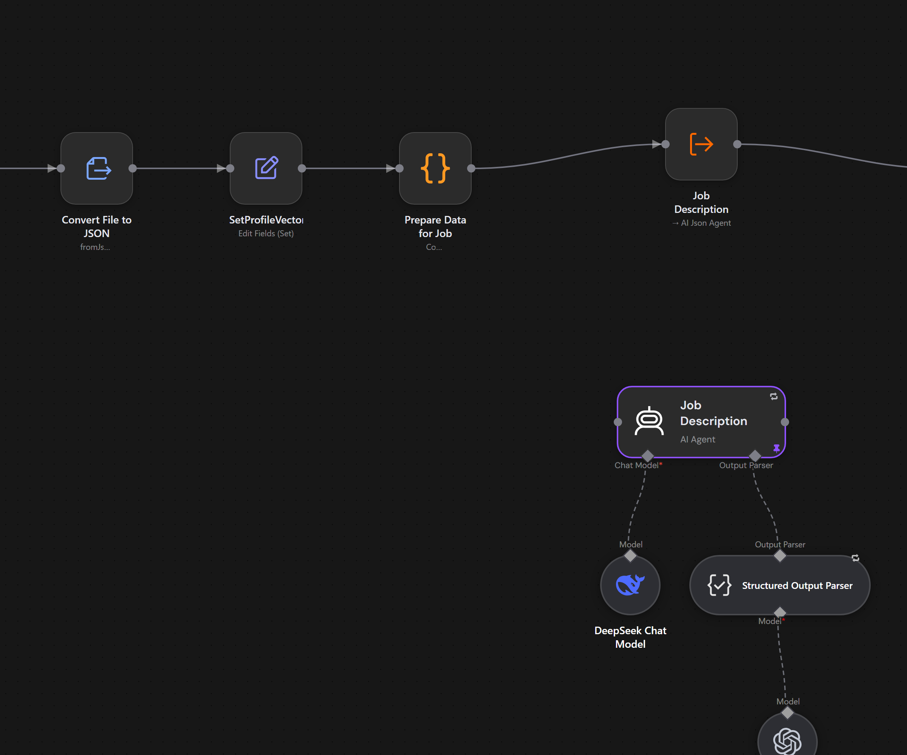
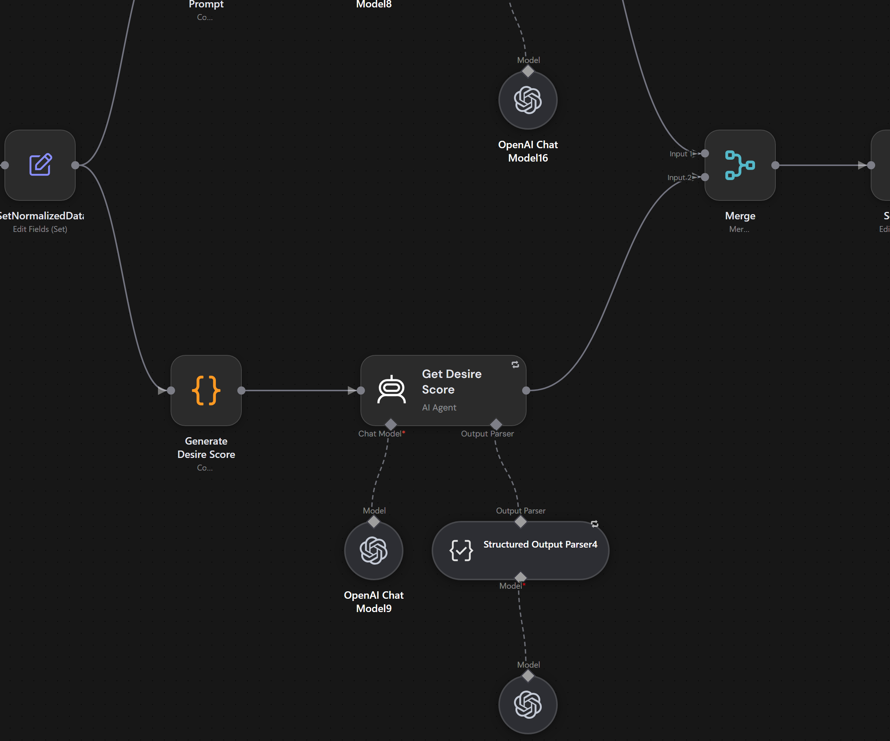
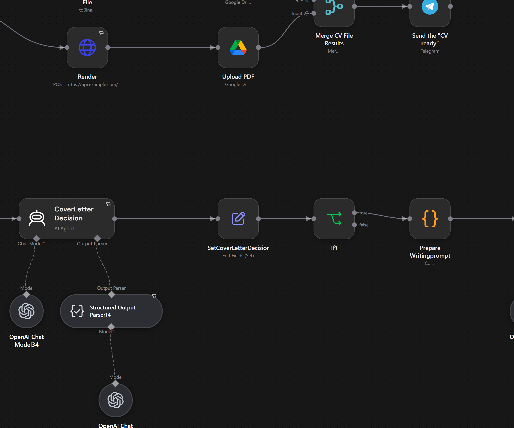
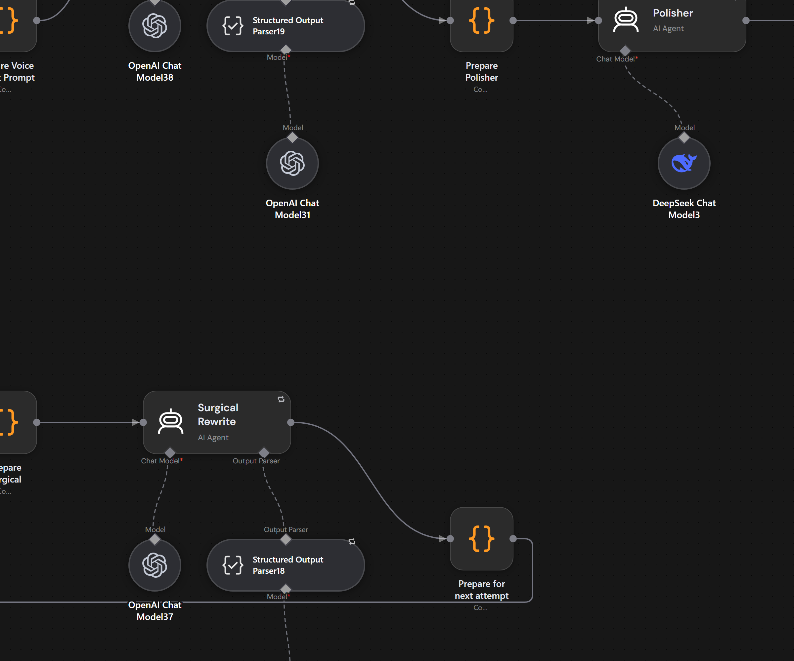

# n8n AI pipelines

Multi-agent LLM pipelines built in n8n and used for real work. The largest flow takes a job
posting and produces a tailored CV and cover letter. The next one reads bank exports and
labels every transaction with a matcher that learns from its own past decisions. The third
builds the profile vectors the job flow matches against.

This repository is the public copy of these workflows. All private data, API keys and sample
payloads were taken out before publishing.

[](images/job-application-pipeline-full.png)

The `job-application` flow from end to end: 169 nodes, starting at the form trigger on the
left and ending with the rendered CV and cover letter on the right. The canvas is 25360
pixels wide, so the overview only shows the shape of the flow. Open it in a new tab for the
full resolution render, or read the four cuts below.

## Highlights

- `job-application` is one workflow with 169 nodes and more than twenty specialist agents.
  They read the posting, research the company, score the fit, select the CV entries that
  matter, write the CV and the cover letter, then loop through a humaniser and an AI pattern
  detector until the text passes. OpenAI and DeepSeek models are mixed in the same run.
- `firefly-import` uses the shared JSON agent as a classifier. Every unknown transaction is
  matched against the merchants seen before, and the decision is written back to the example
  store, so the matcher needs fewer guesses over time.
- `ai-utility` is the shared agent itself. One workflow holds the prompt, the JSON parsing and
  the retries, and a parameter picks Anthropic, OpenAI or DeepSeek, so no caller has to carry
  its own copy of the agent.

## Detail views

Four cuts from the same canvas export, rendered at twice the canvas size so the node names
stay readable.

**Reading the posting** — the newest profile vector is loaded and converted to JSON, and the
job description is handed to the `AI Json Agent`. The agent behind that call runs on DeepSeek
with its own structured output parser.



**Scoring** — two agents score the match, one for fit and one for desire. The cut shows the
desire score agent with its model and parser, the normalized data it runs on and the merge
that combines both scores.



**Rendering and delivery** — the CV is converted to LaTeX, rendered to PDF, uploaded to Drive
and announced over Telegram, while the cover letter decision and its own branch start in
parallel.



**Self review** — the AI pattern detector sends weak text through the surgical rewrite and the
polisher, and `Prepare for next attempt` loops back until it passes.



## Repository layout

```
README.md                 this file
images/                   canvas screenshots used by this README
ai-utility/               shared AI agent that picks its own model provider
csv-reader/               sub-workflow that turns CSV files into JSON rows
json-loader/              sub-workflow that loads a JSON file from Google Drive
notion/                   building blocks for reading and writing Notion pages
firefly-import/           reads bank exports and imports them into Firefly III
job-application/          reads a job posting and writes a CV and a cover letter
profile-vectorizer/       builds a profile vector from the CV data in Google Sheets
```

## What each folder does

| Folder | What it does |
| --- | --- |
| `job-application` | Reads a job posting, filters the stored CV data for what matters and writes a CV plus a cover letter. |
| `firefly-import` | Reads bank CSV exports, labels each transaction with an AI matcher and imports everything into Firefly III. |
| `profile-vectorizer` | Builds a profile vector from the CV data in Google Sheets and stores it for the job pipeline to match against. |
| `ai-utility` | Shared AI agent. One workflow holds the prompt, the JSON parsing and the retry logic, and only the model provider changes. |
| `csv-reader` | Sub-workflow that lists every CSV file in a Google Drive folder, downloads them and turns the rows into JSON. Used by the bank import readers. |
| `json-loader` | Sub-workflow that loads one named JSON file from a Google Drive folder. |
| `notion` | Four building blocks for Notion, such as creating a page, reading a page and walking its child blocks. |

## How the AI parts are built

The workflows share one custom agent instead of each one calling a model on its own.

- `ai-utility` exposes a single `AI Json Agent`. That workflow keeps the system prompt, the
  user prompt, the JSON parsing and the retries. A parameter picks Anthropic, OpenAI or
  DeepSeek, so a caller chooses the model without carrying its own copy of the agent.
- `firefly-import` turns that agent into a classifier. `Get Best Match` loads the known
  merchants and the past decisions, asks the agent for the best match and writes the new
  example back to the store. The matcher learns from its own history, which is a small
  agent loop wrapped around one model.
- `job-application` is the largest multi agent flow. More than twenty specialist agents run
  in one pass. Some read the posting and research the company, others score the fit and the
  wish, others pick skills, experiences and projects, and a final group writes, humanises and
  polishes the CV and the cover letter. The agents mix OpenAI and DeepSeek models.
- `profile-vectorizer` uses Anthropic to build and enrich the profile vectors that the job
  pipeline compares against.

The models are not decoration. They make decisions inside the flows and hand structured JSON
to each other. In `job-application` the AI detection step even loops back and tries again
until the text passes.

## How the pipelines link to each other

A few folders call workflows that live in another folder. Import everything into the same
n8n instance so those calls resolve.

- `firefly-import` calls the `csv-reader` workflow from three of its four bank readers and
  calls `ai-utility` through `Get Best Match`.
- `job-application` calls `ai-utility`.
- `notion` and `json-loader` are standalone building blocks. Nothing inside this repository
  calls them, so you can wire them into any workflow that needs them.

## Importing the workflows

1. In n8n, open the workflow menu and choose Import from File.
2. Import every file from the folder you need, then repeat for the folders it depends on.
3. Sub-workflow nodes point at their target by workflow ID. n8n gives each workflow a new ID
   on import, so open every `Execute Sub-workflow` node and pick its target again. You can
   also switch the node to the name lookup mode, which keeps working after a re-import. The
   recursive Notion block loader already uses that mode.

## Environment variables

Set these in the n8n environment before you run the pipelines.

| Variable | Used by |
| --- | --- |
| `MATCHING_API_KEY` | `firefly-import/Get Best Match`, `firefly-import/SUBSET - Import Data to Firefly`, `job-application/Job Application Pipeline` |
| `TELEGRAM_CHAT_ID` | `job-application/Job Application Pipeline`, `profile-vectorizer/Profile Vectorizer` |

## Credentials

The exported files hold no keys of their own. They expect these n8n credentials, which you
create once in the target instance:

- Google Drive, Google Sheets and Google Docs
- Notion
- Telegram
- Anthropic, OpenAI and DeepSeek
- HTTP bearer auth, HTTP basic auth and HTTP header auth

## External services

The exported workflows point at two placeholder domains. Replace them with your own self
hosted services before you run the finance or the job pipelines.

- `https://api.example.com` handles transaction matching, candidate examples, Firefly
  category and budget helpers, and the LaTeX rendering of CVs and cover letters.
- `https://firefly.example.com` is the Firefly III instance.

Both expect the `x-api-key` header set to `MATCHING_API_KEY`.

## What was removed before publishing

- Pinned data in every workflow. It held real bank transactions, job postings, Telegram
  messages, CV content and article drafts.
- Hardcoded API keys. They are now `$env` expressions.
- Contact details, date of birth, nationality, location and profile links from the early job
  pipeline prototype. That prototype is not part of this repository.
- Host names, the Telegram chat ID and the workflow author name. Hosts are now placeholder
  domains, the chat ID is a `TELEGRAM_CHAT_ID` expression and the author field is empty. The
  canvas export behind the screenshots carried the same host name in two node subtitles, so it
  was sanitized before rendering.

## Notes before you reuse this

- The finance and the job pipelines point at the placeholder domains above. Repoint them at
  your own services and set `MATCHING_API_KEY` and `TELEGRAM_CHAT_ID` before you run them.
- Notion database and page IDs stay in the workflows because the calls need them. Notion
  permissions are what protect the data. The same is true for the Google Drive, Sheets and
  Docs file IDs, which the Google account permissions protect.
- Sub-workflow calls resolve by workflow ID or by workflow name. Import the folders together
  and check every `Execute Sub-workflow` node once.

## License

MIT. See [LICENSE](LICENSE).
