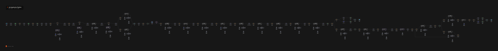

# job-application

Takes a job posting, filters the stored CV data for what matters, generates a CV and a cover
letter, renders them through a LaTeX service and reports progress over Telegram.



The canvas above shows all 169 nodes of the main workflow, from the form trigger on the left
to the rendered CV and cover letter on the right.

## Workflows

| File | Workflow name | ID | Active | Nodes | Role |
| --- | --- | --- | --- | --- | --- |
| `Job Application Pipeline.json` | Job Application Pipeline | `XcCsfhFsPS9V6pSA` | yes | 169 | Main pipeline, started from a form trigger. Scrapes the posting, scores the match, plans the CV, writes and renders the CV and the cover letter and sends Telegram updates. |
| `Load-cv-data.json` | Load-cv-data | `GvVL2xA14QTdda2q` | yes | 14 | Loads the CV sheets and returns structured profile data. |
| `Load-job-description.json` | Load-job-description | `vds3gMzBpCwr7hrM` | yes | 3 | Loads the job description document. |
| `GetRelevantDataForCV.json` | GetRelevantDataForCV | `gj8p6sW1RvqLfsna` | yes | 4 | Picks the CV entries that matter for a given posting. |
| `Add skills.json` | Add skills | `bbkeCVaxRhO7Ood8` | no | 9 | Adds missing skills to the CV data. |
| `Add achievements.json` | Add achievements | `QMQQjx19BFGfxvxS` | no | 9 | Adds missing achievements to the CV data. |
| `Add key achievements.json` | Add key achievements | `bMqfQ132zYPJj1n9` | no | 9 | Adds key achievements to the CV data. |

## Dependency graph

```
Job Application Pipeline (form trigger)
  -> AI Json Agent            [ai-utility]
  -> api.example.com/latex/render
Add skills / Add achievements / Add key achievements
  -> Load-cv-data, Load-job-description
GetRelevantDataForCV -> Load-cv-data
```

All helpers live in this folder, so the folder works as a unit once `ai-utility` is imported
into the same instance.

## How the AI parts work

The pipeline is a multi agent system. More than twenty specialist agents run in one pass and
hand JSON to each other. They fall into five groups:

- Reading: `Job Description Data Extractor` turns the posting into structured facts,
  `Company Researcher` adds background and `Validate & Normalize` cleans the result.
- Matching: `Role Analysis And Framing`, `Get Fit Score` and `Get Desire Score` weigh the
  posting against the stored profile. `Skill Selection`, `Select Experiences`, `Select
  Projects` and `Select Project Descriptions` then pick the parts of the CV that matter.
- Layout: `Personal Data and Photo Decision` and `Visual Strategy` decide what the CV shows.
- Writing: `Brief Generator`, `Professional Summary`, `Job Bullets Generation`,
  `Draft Writer`, `CoverLetter Decision` and `Language Selector` produce the CV and the cover
  letter.
- Self review: `Humanizer`, `AI Pattern Detector`, `Surgical Rewrite`, `Voice And
  Authenticity Check` and `Polisher` rewrite the text until it reads like a person. The AI
  detector sends weak text back for another attempt.

The agents mix OpenAI and DeepSeek models. The profile vectors produced by
`profile-vectorizer` are what the matching agents compare against, so the pipeline improves
as those vectors improve.

## Dependencies

- Credentials: OpenAI, DeepSeek, Google Drive, Google Sheets, Google Docs, Telegram and HTTP
  basic.
- Environment: `MATCHING_API_KEY` for the LaTeX rendering calls and `TELEGRAM_CHAT_ID` for
  the notifications.
- External services: `api.example.com` for the CV and cover letter rendering. It is a
  placeholder, so repoint it at your own service. The pipeline also consumes the profile
  vectors produced by `profile-vectorizer`, which is why the two folders are usually
  deployed together.

## Notes

Pinned data was emptied before publishing. It held a real job description, Telegram messages
with the account holder name and chat ID, browser cookies and CV content. A hardcoded API
key was replaced with the environment expression and the live chat ID is now a
`TELEGRAM_CHAT_ID` expression.

The pipeline is deliberately kept as one workflow. Splitting it into smaller pipelines would
mean re-wiring around 169 nodes inside the n8n editor, which cannot be done safely by
editing the exported JSON.
